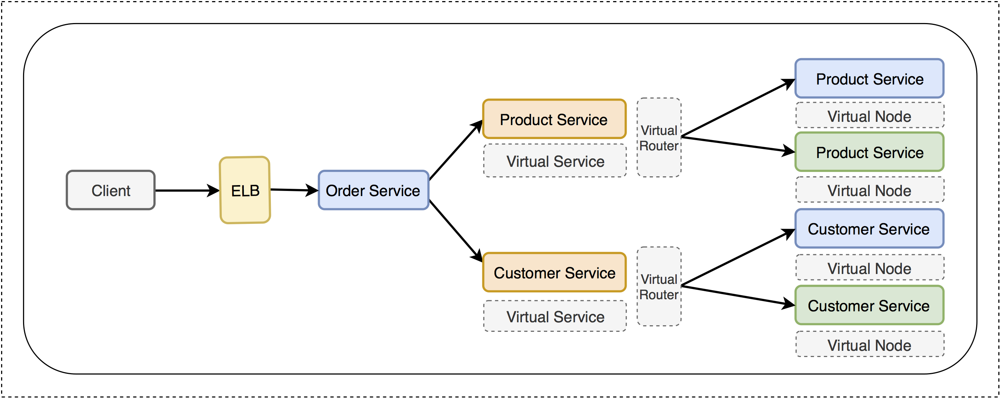
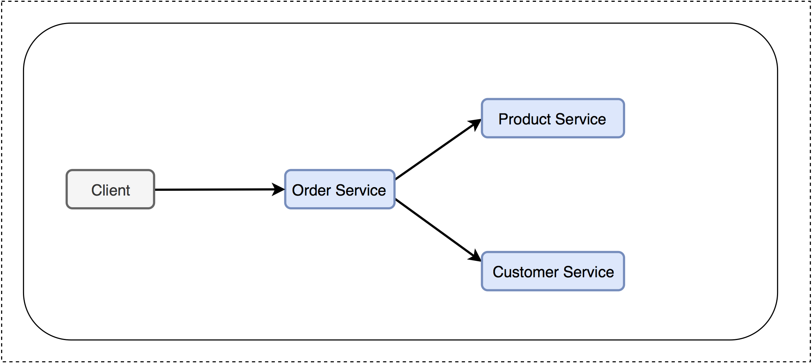
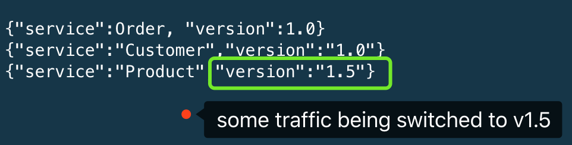
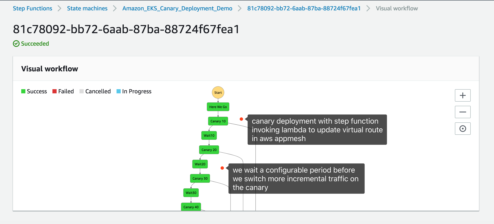
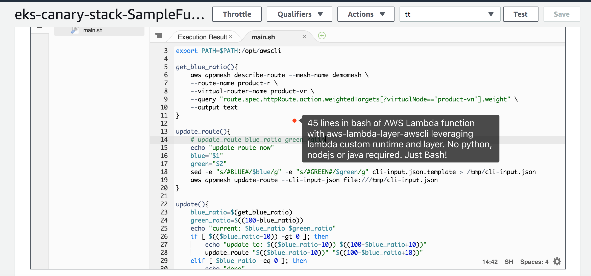
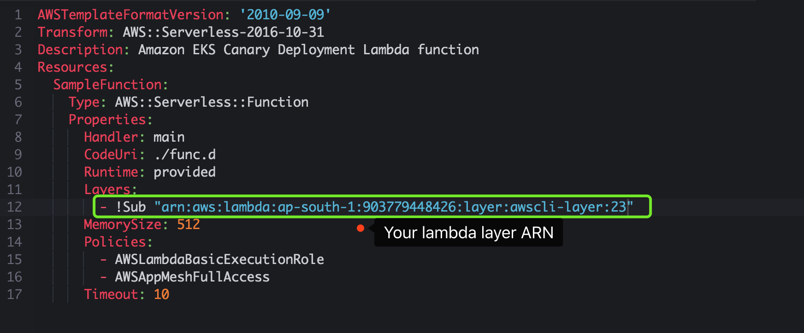
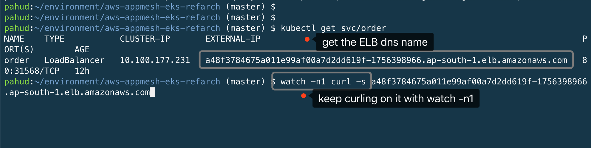
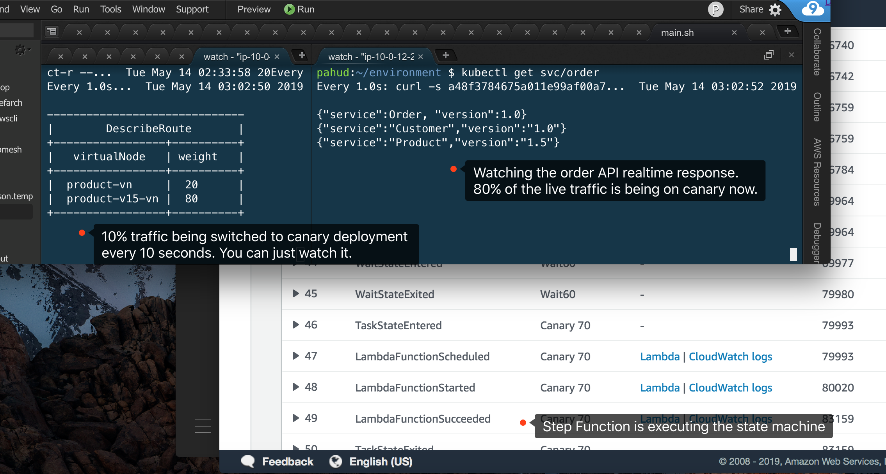

# eks-canary-deployment-stepfunction
Reference Architecture of Canary Deployment with Amazon EKS and AWS Step Functions

## Architecture Overview



(Diagram A)

## Main Services

- **Order Service** - A public-facing service API that query product service and customer service and response to the client
- **Product Service** - Internal service for product info lookup.
- **Customer Service** - Internal service for customer info lookup.




(Diagram B)

## Step 1 - Creating the Mesh

```bash
cd ./mesh
bash 01-create_mesh.sh 
```

This will create `demomesh` as the service mesh and `virtual node`, `virtual router`, and `route` for `3` services. And 2 `virtual services` for `customer service` and `product service` will be created as well.


## Step 2 - Deploy the v1 services into Amazon EKS

Now we're gonna deploy v1 of the 3 services into the Amazon EKS cluster.

```
cd ../k8s
bash deploy_v1.sh 
```

Response

```
deployment.extensions/product created
service/product created
deployment.extensions/customer created
service/customer created
deployment.extensions/order created
service/order created
NAME                 TYPE           CLUSTER-IP      EXTERNAL-IP   PORT(S)        AGE
service/customer     ClusterIP      10.100.113.89   <none>        8080/TCP       4s
service/kubernetes   ClusterIP      10.100.0.1      <none>        443/TCP        23h
service/order        LoadBalancer   10.100.27.80    <pending>     80:31888/TCP   2s
service/product      ClusterIP      10.100.230.95   <none>        8080/TCP       6s

NAME                             DESIRED   CURRENT   UP-TO-DATE   AVAILABLE   AGE
deployment.extensions/customer   1         1         1            0           4s
deployment.extensions/order      1         1         1            0           2s
deployment.extensions/product    1         1         1            1           6s

NAME                            READY   STATUS            RESTARTS   AGE
pod/customer-7976f6c89c-snwvg   0/2     PodInitializing   0          4s
pod/order-868bb64dcf-dx6pt      0/2     PodInitializing   0          2s
pod/product-74b96c4f46-g5rwr    2/2     Running           0          6s
```

The `product` and `customer` services will be exposed as `ClusterIP` while `order` service will be exposed with `LoadBalancer` type. It might take a few minutes before the ELB is ready.


## Step 3 - Test the Services

Let's test the `product` service with `kubectl port-forward` like this:

```
$ kubectl port-forward deployment/product 8080:8080
Forwarding from 127.0.0.1:8080 -> 8080
Forwarding from [::1]:8080 -> 8080
```

Open another terminal and `cURL` on **localhost:8080**

```
$ curl localhost:8080/
{"service":"Product","version":"1.0"}
```

`Ctrl-c` to terminate the `port-forward` terminal and test `customer` service

```
$ kubectl port-forward deployment/customer 8080:8080
Forwarding from 127.0.0.1:8080 -> 8080
Forwarding from [::1]:8080 -> 8080
```

```
$ curl localhost:8080/
{"service":"Customer","version":"1.0"}
```

Both `Product` and `Customer` services are running with version `1.0` now.

Finally, let's test the `Order` service agains the ELB.

```
$ kubectl get svc/order
NAME    TYPE           CLUSTER-IP     EXTERNAL-IP                                                                PORT(S)        AGE
order   LoadBalancer   10.100.27.80   a8d4ac145757e11e99af00a7d2dd619f-1485101703.ap-south-1.elb.amazonaws.com   80:31888/TCP   6m7s
```

(please note your ELB DNS name should be different from above)

```
$ curl a8d4ac145757e11e99af00a7d2dd619f-1485101703.ap-south-1.elb.amazonaws.com
{"service":Order, "version":1.0}
{"service":"Product","version":"1.0"}
{"service":"Customer","version":"1.0"}
```

Behind the scene, the order service on receiving the request will call `Product` and `Customer` services in parallel and return all the response to the client. Make sure they all return version `1.0`


Let's run this command with `watch -n1` and keep this terminal open.

```
$ watch -n1 curl -s a8d4ac145757e11e99af00a7d2dd619f-1485101703.ap-south-1.elb.amazonaws.com
```

(This will execute the `curl` command every `1` second. You will see the respose is very consistent with all `1.0` version )


## Step 4 - Deploy product service to 1.5

Let's say if we are planing to upgrade the product service to `1.5`. So we deploy another `1.5` deployment:

Open another terminal and run:

```
cd ../k8s
bash deploy_product_v15.sh 
```

Response

```
deployment.extensions/product-v15 created
service/product-v15 created
NAME                  TYPE           CLUSTER-IP      EXTERNAL-IP                                                                PORT(S)        AGE
service/customer      ClusterIP      10.100.113.89   <none>                                                                     8080/TCP       12m
service/kubernetes    ClusterIP      10.100.0.1      <none>                                                                     443/TCP        23h
service/order         LoadBalancer   10.100.27.80    a8d4ac145757e11e99af00a7d2dd619f-1485101703.ap-south-1.elb.amazonaws.com   80:31888/TCP   12m
service/product       ClusterIP      10.100.230.95   <none>                                                                     8080/TCP       12m
service/product-v15   ClusterIP      10.100.82.11    <none>                                                                     8080/TCP       2s

NAME                                DESIRED   CURRENT   UP-TO-DATE   AVAILABLE   AGE
deployment.extensions/customer      1         1         1            1           12m
deployment.extensions/order         1         1         1            1           12m
deployment.extensions/product       1         1         1            1           12m
deployment.extensions/product-v15   1         1         1            0           2s

NAME                               READY   STATUS            RESTARTS   AGE
pod/customer-7976f6c89c-snwvg      2/2     Running           0          12m
pod/order-868bb64dcf-dx6pt         2/2     Running           0          12m
pod/product-74b96c4f46-g5rwr       2/2     Running           0          12m
pod/product-v15-6db9ccbc58-tfmz2   0/2     PodInitializing   0          2s
```

A new standalone deployment named `product-v15` is being deployed.

OK now we have `product-v1` running with live traffic while `product-v15` is also ready. Let's create a `virtual node` for `product-v15` and start the canary deployment on it.

```
cd ../mesh
bash 02-update-mesh-v15.sh 
```

(this will create a `virtual node` called `product-v15-vn` for the `product-v15` service)


## Step 5 - Canary Deployment on Product v1.5

```
bash 03-deploy-prod-v15-canary.sh
```

This will update the product vertiaul route between `v1` and `v15` with different traffic weight.

```
        "weightedTargets": [
          {
            "virtualNode": "product-vn",
            "weight": 75
          },
          {
            "virtualNode": "product-v15-vn",
            "weight": 25
          }
        ]
```

check `./mesh/v15/product-canary.json` for details. You may update `product-canary.json` and run `bash 03-deploy-prod-v15-canary.sh` agan to apply the new traffic weight.




Now, let's switch 100% traffic to `v1.5`.

```
bash 04-deploy-prod-full.sh
```

Now the `Product` version is being steady at `1.5` because we've change the `virtual route` to switch `100%` traffic onto `product-v15`.

## Step 6 - Canary Deployment on Customer v2

Similarily,  let's deploy a `v2` for customer service with `kubectl` and canary deploy on it.


```
cd ../k8s
bash deploy_customer_v2.sh 
```

Response

```
deployment.extensions/customer-v2 created
service/customer-v2 created
NAME                                DESIRED   CURRENT   UP-TO-DATE   AVAILABLE   AGE
deployment.extensions/customer      1         1         1            1           28m
deployment.extensions/customer-v2   1         1         1            0           2s
deployment.extensions/order         1         1         1            1           27m
deployment.extensions/product       1         1         1            1           28m
deployment.extensions/product-v15   1         1         1            1           15m

NAME                  TYPE           CLUSTER-IP      EXTERNAL-IP                                                                PORT(S)        AGE
service/customer      ClusterIP      10.100.113.89   <none>                                                                     8080/TCP       28m
service/customer-v2   ClusterIP      10.100.102.79   <none>                                                                     8080/TCP       2s
service/kubernetes    ClusterIP      10.100.0.1      <none>                                                                     443/TCP        23h
service/order         LoadBalancer   10.100.27.80    a8d4ac145757e11e99af00a7d2dd619f-1485101703.ap-south-1.elb.amazonaws.com   80:31888/TCP   27m
service/product       ClusterIP      10.100.230.95   <none>                                                                     8080/TCP       28m
service/product-v15   ClusterIP      10.100.82.11    <none>                                                                     8080/TCP       15m

NAME                               READY   STATUS            RESTARTS   AGE
pod/customer-7976f6c89c-snwvg      2/2     Running           0          28m
pod/customer-v2-5648d668df-wfpgc   0/2     PodInitializing   0          2s
pod/order-868bb64dcf-dx6pt         2/2     Running           0          27m
pod/product-74b96c4f46-g5rwr       2/2     Running           0          28m
pod/product-v15-6db9ccbc58-tfmz2   2/2     Running           0          15m
```

Create a `customer-v2` virtual node for it.

```
cd ../mesh
bash 05-update-mesh-v2.sh
```

Update the `virtual route` to canary deploy the `v2`.

```
bash 06-deploy-customer-v2-canary.sh
```


You might also update `./v2/customer-canary.json` to set different weight of traffic and run again.

When you are ready, switch 100% traffic to customer service v2 now:

```
bash 07-deploy-customer-full.sh
```

Now we have 100% traiffic going to `order` `v1.0`, `customer` `v2.0` and `product` `v1.5` with zero impact on the service. All traffic is being routed as expected.


## Step. 7 - Immediate Roll Back 

Chances are we might need an immediate rollback to previous all `v1.0` version. We can just do it like this:

```
$ bash 08-rollback-v1.sh
```

This will update the virtual route of `product` and `cutomer` services to set `100%` traffic going to the v1 virtual node. Immediately all traffic goes to `1.0` as below:

```
{"service":Order, "version":1.0}
{"service":"Product","version":"1.0"}
{"service":"Customer","version":"1.0"}
```


## Conclusion

I hope you enjoy this demo. Moving forward, you may consider using [aws/aws-app-mesh-inject](aws/aws-app-mesh-inject) to auto inject the sidecar proxy into your deployment to simplified the YAML configuration.


## Clean up

delete the mesh

```
bash 99-delete_mesh.sh
```

delete the k8s deployment

```
cd ../k8s
bash delete_all.sh 
```

Response

```
deployment.extensions "product" deleted
service "product" deleted
deployment.extensions "customer" deleted
service "customer" deleted
deployment.extensions "order" deleted
service "order" deleted
deployment.extensions "product-v15" deleted
service "product-v15" deleted
deployment.extensions "customer-v2" deleted
service "customer-v2" deleted
```

That's all.

Have fun!


# Step Function Integration for Automated Canary Deployment

You may build your state machine with AWS Step Function for automated canary deployment. For example, 10% incremental traffic every 10 minutes until 100% or 10% initial canary traffic for 5min and immediately switch 100% after 10 minutes. AWS Step Functions gives you flexibility to define your canary deployment strategy while Lambda function being invoked by AWS Step Function can update the virtual route on AWS App Mesh for you.







## Step 1 - Prepare Your Lambda function

We are going to build our own [aws-lambda-layer-awscli](https://github.com/aws-samples/aws-lambda-layer-awscli) from scratch

```
cd stepfunc/lambda/
make build layer-zip layer-upload layer-publish
```

Response

```
{
    "LayerVersionArn": "arn:aws:lambda:ap-south-1:903779448426:layer:awscli-layer:23", 
    "Description": "awscli-layer", 
    "CreatedDate": "2019-05-14T05:18:40.388+0000", 
    "LayerArn": "arn:aws:lambda:ap-south-1:903779448426:layer:awscli-layer", 
    "Content": {
        "CodeSize": 22977865, 
        "CodeSha256": "Tg6Yjr99B1MXRSs0uGhSWaTZKdLtob3nHPugfn0eIAs=", 
        "Location": "..."
    }, 
    "Version": 23, 
    "CompatibleRuntimes": [
        "provided"
    ], 
    "LicenseInfo": "MIT"
}
```

Copy the **LayerVersionArn** value string.

update `sam.yaml` and configure the `Layers` with **LayerVersionArn** provided above.



OK. Let's publish our Lambda function.

update the `Makefile` and define your own parameters such as `S3BUCKET` and `LAMBDA_REGION`. Make sure your current IAM identity has read/write to `S3BUCKET` bucket and `LAMBDA_REGION` is the correct AWS region you are deploying to.

```
make sam-package sam-deploy
```

Response

```
Successfully packaged artifacts and wrote output template to file packaged.yaml.
Execute the following command to deploy the packaged template
aws cloudformation deploy --template-file /home/samcli/workdir/packaged.yaml --stack-name <YOUR STACK NAME>

Waiting for changeset to be created..
Waiting for stack create/update to complete
Successfully created/updated stack - eks-canary-stack
# print the cloudformation stack outputs
aws --region ap-south-1 cloudformation describe-stacks --stack-name "eks-canary-stack" --query 'Stacks[0].Outputs'
[
    {
        "Description": "Function ARN", 
        "OutputKey": "FunctionArn", 
        "OutputValue": "arn:aws:lambda:ap-south-1:903779448426:function:eks-canary-stack-Function-8BYBEJIPXV6D"
    }
]
```

Now your lambda function is deployed. Copy the **FunctionArn** value above.


## Step 2 - Prepare Your State Machine in Step Function

Create a new step function with the provided spec JSON [here](https://github.com/pahud/aws-appmesh-eks-refarch/blob/master/stepfunc/spec.json). Make sure update the Task Resource arn to your own Lambda function arn above.


## Step 3 - Monitoring

Before we execute the state machine, let's monitor our application with two seperate tabs or windows.


In the 1st tab we monitor the different weighted targets in the product virtual route with `watch -n1`.  The result will refresh every second.

```
$ watch -n1 aws appmesh describe-route --mesh-name demomesh --route-name product-r --virtual-router-name product-vr --query "route.spec.httpRoute.action.weightedTargets" --output table
------------------------------
|        DescribeRoute       |
+-----------------+----------+
|   virtualNode   | weight   |
+-----------------+----------+
|  product-vn     |  100     |
|  product-v15-vn |  0       |
+-----------------+----------+
```

In the 2nd tab we keep curling on the ELB of the order service.




## Step 4 - Execute the State Machine

OK let's execute the state machine in step function. Watch the state machine in the step function console.


And also watch the changes of the two tabs.




## Conclusion

In this demo, we walks you through how to build a customized Amaozn EKS canary deployment with AWS Step Function, AWS Lambda and AWS App Mesh. I hope you enjoy it and customize your own deployment logic based on it.
